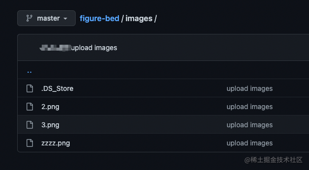

使用github作为图片仓库，jsDelivr 作为CND加速，在不使用其他工具的情况下，已经足够作为一个图床来使用了。

在github创建一个空的仓库，我的叫做 `figure-bed` ，直接从本地上传几张图片到 `/images` 目录下。

现在里面的图片已经可以打开了，如下。

地址为：
https://raw.githubusercontent.com/SikyChen/figure-bed/master/images/2.png

如果国内网络，有可能打不开这个图片。

转为 jsDelivr 的地址为：
https://cdn.jsdelivr.net/gh/sikychen/figure-bed@master/images/2.png

这个地址很好解释：
- `sikychen` 代表github的用户名
- `figure-bed` 代表仓库名
- `master` 代表分支名，由于我们是用来存放图片，那么直接使用 master 分支就好了
- `/images/2.png` 最后的部分，就是图片存放的地址了

如下图片就是使用了 jsDelivr 地址引入的图片，可以将图片拖拽到一个新的浏览器页签中查看它的地址哦：

PS：github 仓库必须是公开的才能够使用，所以要注意别把包含私密信息的图片上传进去哟~
