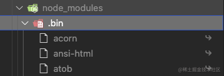
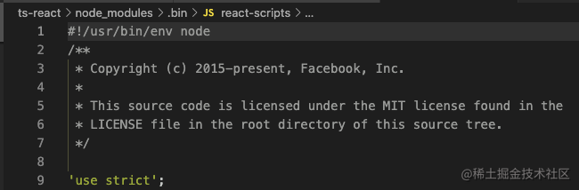
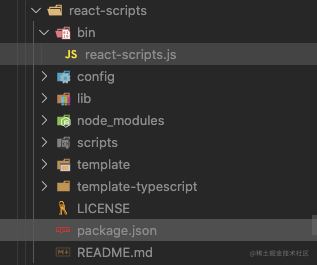
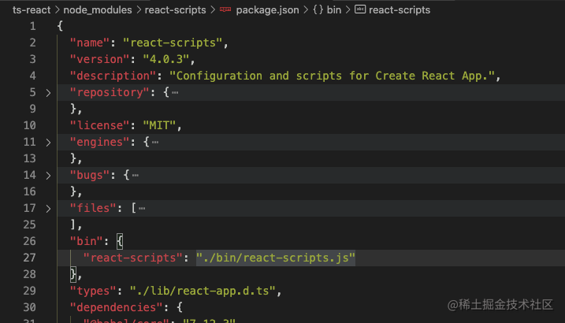

在前端开发的工作当中，使用 `npm run dev` 的命令启动本地开发环境，是再正常不过的事了。那么，当输入完类似 `npm run xxx` 的命令后，究竟是如何触发各种构建工具的构建命令以及启动 Node 服务等功能的呢？

首先我们知道，Node 作为 JavaScript 的运行时，可以把 `.js` 文件当做脚本来运行，像这种：
``` shell
node index.js
```

当我们使用 `npm` 来管理项目（或者 `yarn`）时，会在根目录下生成一个 `package.json` 文件，其中的 `scripts` 属性，就是用于配置 `npm run xxx` 命令的，比如我有如下配置：
``` json
// package.json
{
  // ...
  "scripts": {
    "start": "node ./src/index.js",
    "build": "react-scripts build",
  },
  // ...
}
```

当执行 `npm start` 时，对于 `npm` 来说，相当于执行 `npm run start` ，则映射为 `scripts` 属性下的 `start` 命令，即
``` bash
npm start
# 相当于
npm run start
# 相当于
node ./src/index.js
```
这个比较好理解，就是直接使用全局安装的 Node 命令来执行了 `./src` 目录下的 `index.js` 文件而已。

如上面类似，执行 `npm run build` 即相当于执行 `react-scripts build` 命令。这个命令，是使用 `create-react-app` 搭建 React 项目时默认配置的。与 Node 不同，`react-scripts` 并没有全局安装，怎么就能直接执行呢？

这时我们不妨看一下，使用 `create-react-app` 搭建的项目（使用 `vue-cli` 搭建的项目也一样），在 `npm install` 后，其 `node_modules` 目录下面的样子：



如图可以看到有一个 `.bin` 目录，这个目录不是任何一个 `npm` 包。目录下的文件，右面都有一个小箭头（VS Code 上这样显示），表示这是一个软链接，打开文件可以看到文件顶部写着 `#!/user/bin/env node` ，表示这是一个通过使用 Node 执行的脚本。



由此我们可以知道，当使用 `npm run build` 执行 `react-scripts build` 时，虽然没有安装 `react-scripts` 的全局命令，但是 `npm` 会到 `./node_modules/.bin` 中找到 `react-scripts.js` 文件作为 Node 脚本来执行，则相当于执行了 `./node_modules/.bin/react-scripts build`（最后的 `build` 作为参数传入）。
``` bash
npm run build
# 相当于
./node_modules/.bin/react-scripts build
```

前面说过，`react-scripts` 是一个软链接，那么它的指向是哪里，又是怎么来的呢？

我们可以在 `node_modules` 目录下，直接找到 `react-scripts` 包，查看其目录结构和 `package.json` 如下：





从 `package.json` 中可知，这个包将 `./bin/react-scripts.js` 作为 `bin` 声明了。所以在 `npm install` 时，`npm` 读到该配置后，就将该文件软链接到 `./node_modules/.bin` 目录下，而 `npm` 还会自动把node_modules/.bin加入$PATH，这样就可以直接作为命令运行依赖程序和开发依赖程序，不用全局安装了。

假如我们在安装包时，使用 `npm install -g xxx` 来安装，那么会将其中的 `bin` 文件加入到全局，比如 `create-react-app` 和 `vue-cli` ，在全局安装后，就可以直接使用如 `vue-cli projectName` 这样的命令来创建项目了。